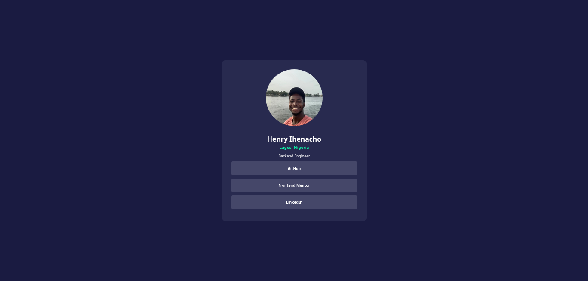

# Frontend Mentor - Social links profile solution

This is a solution to the [Social links profile challenge on Frontend Mentor](https://www.frontendmentor.io/challenges/social-links-profile-UG32l9m6dQ). Frontend Mentor challenges help you improve your coding skills by building realistic projects.

## Table of contents

- [Overview](#overview)
  - [The challenge](#the-challenge)
  - [Screenshot](#screenshot)
  - [Links](#links)
- [My process](#my-process)
  - [Built with](#built-with)
  - [What I learned](#what-i-learned)

## Overview

### The challenge

Users should be able to:

- See hover and focus states for all interactive elements on the page

### Screenshot

### Links

- Solution URL: [Add live site URL here](https://your-live-site-url.com)
- Live Site URL:  [GitHub Pages](https://henrychris.github.io/social-links/)

## My process

### Built with

- HTML
- CSS
- Flexbox

### What I learned

- Use `border radius` of `50%` to make an image circle.
- Add `target="_blank"` to anchor tag to open a link in a new tab.
